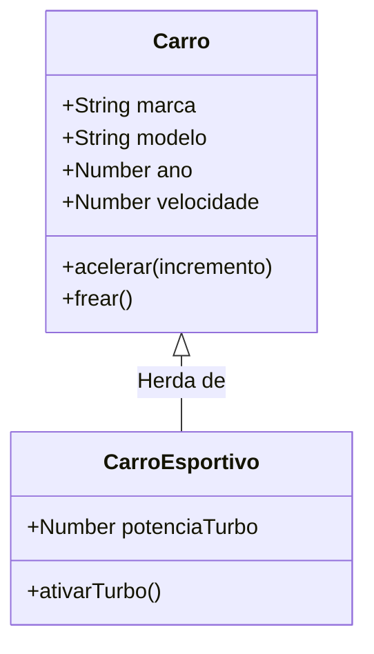

# Conceito de Objeto

### O Mundo é uma Coleção de Objetos


Olá, pessoal!

Vamos começar a enxergar o mundo da programação de uma forma diferente. Pense ao seu redor: você está vendo um computador, uma mesa, talvez uma caneca de café.

No nosso dia a dia, interagimos com **objetos**. A programação orientada a objetos (POO ou OOP) traz essa mesma ideia para o nosso código.

Vamos começar a enxergar o mundo da programação de uma forma diferente. Pense ao seu redor: você está vendo um computador, uma mesa, talvez uma caneca de café.

No nosso dia a dia, interagimos com **objetos**. A programação orientada a objetos (POO ou OOP) traz essa mesma ideia para o nosso código.


***

### O que são Objetos?

Objetos são entidades (coisas) relevantes para o nosso sistema.

Todo objeto possui duas características principais:

* **Atributos (ou Propriedades):** São os dados, as características do objeto.
  * _Exemplo de um carro:_ cor, marca, ano, velocidade atual.
* **Comportamentos (ou Métodos):** São as ações que o objeto pode realizar.
  * _Exemplo de um carro:_ acelerar, frear, ligar o farol.

***

### Objeto em JavaScript: A Forma Literal

Em JavaScript, podemos criar um objeto de forma muito direta. Chamamos isso de "objeto literal".

```javascript
// Criando um objeto 'carro'
const carro1 = {
  // Atributos (Propriedades)
  marca: "Fiat",
  modelo: "Uno",
  ano: 1995,
  cor: "Vermelho",
  velocidade: 0,

  // Comportamentos (Métodos)
  acelerar: function(incremento) {
    this.velocidade += incremento;
    console.log(`Acelerando! Velocidade atual: ${this.velocidade} km/h`);
  },

  frear: function() {
    this.velocidade = 0;
    console.log("Carro parado.");
  }
};

// Usando o objeto
console.log(carro1.marca); // Saída: Fiat
carro1.acelerar(50);      // Saída: Acelerando! Velocidade atual: 50 km/h
```

***

### O Problema: E se precisarmos de 100 carros?

O objeto literal é ótimo, mas imagine criar `carro2`, `carro3`, `carro100`... copiando e colando todo esse código?

* Seria repetitivo.
* Seria difícil de manter (se um método mudar, teríamos que alterar em 100 lugares).
* Seria propenso a erros.

Precisamos de um molde, uma planta baixa para criar quantos carros quisermos de forma padronizada.

***

### Classes: O Molde dos Objetos

Uma Classe é exatamente isso: um molde ou um projeto para criar objetos.

* A classe define quais atributos e quais métodos os objetos criados a partir dela terão.
* Ela não é o objeto em si, mas sim o que dá origem a ele.

Pense na classe como a planta de uma casa e o objeto como a casa construída. Podemos construir várias casas (objetos) a partir da mesma planta (classe).

***

### Criando nossa Primeira Classe em JS

A partir do ES6 (ECMAScript 2015), o JavaScript ganhou uma sintaxe muito mais clara para criar classes.

O método `constructor` é especial: ele é chamado automaticamente quando um novo objeto é criado (`new`) e serve para inicializar os atributos.

```javascript
class Carro {
  // O construtor define os atributos iniciais do objeto
  constructor(marca, modelo, ano, cor) {
    this.marca = marca;
    this.modelo = modelo;
    this.ano = ano;
    this.cor = cor;
    this.velocidade = 0; // Valor padrão
  }

  // Métodos (comportamentos)
  acelerar(incremento) {
    this.velocidade += incremento;
    console.log(`Acelerando! Velocidade atual: ${this.velocidade} km/h`);
  }

  frear() {
    this.velocidade = 0;
    console.log(`${this.modelo} parado.`);
  }
}
```

***

### Criando Objetos (Instâncias) a partir da Classe

Uma vez que temos o "molde" (a classe `Carro`), podemos criar quantos objetos quisermos. O ato de criar um objeto a partir de uma classe é chamado de instanciar.

```javascript
// Usando a classe 'Carro' para criar duas instâncias (objetos)
const meuFusca = new Carro("Volkswagen", "Fusca", 1978, "Azul");
const minhaBrasilia = new Carro("Volkswagen", "Brasília", 1980, "Amarela");

// Cada objeto tem seus próprios dados, mas compartilham os mesmos comportamentos
console.log(meuFusca.modelo);         // Saída: Fusca
console.log(minhaBrasilia.modelo);    // Saída: Brasília

meuFusca.acelerar(80);                // Saída: Acelerando! Velocidade atual: 80 km/h
minhaBrasilia.acelerar(60);           // Saída: Acelerando! Velocidade atual: 60 km/h
```

***

### Conceito Fundamental: Herança

E se quisermos criar um `CarroEsportivo`? Ele é um `Carro`, mas talvez tenha um método extra como `ativarTurbo()`.

A Herança permite que uma classe (filha) herde atributos e métodos de outra classe (pai). Isso promove a reutilização de código!

Usamos a palavra-chave `extends`.

***

### Herança na Prática

A classe `CarroEsportivo` estende a classe `Carro`.

```javascript
class CarroEsportivo extends Carro {
  // O construtor da classe filha precisa chamar o construtor da classe pai
  constructor(marca, modelo, ano, cor, potenciaTurbo) {
    super(marca, modelo, ano, cor); // 'super' chama o construtor de Carro
    this.potenciaTurbo = potenciaTurbo;
  }

  // Método específico desta classe
  ativarTurbo() {
    // Aumenta a velocidade usando a potência do turbo
    this.acelerar(this.potenciaTurbo);
    console.log("TURBO ATIVADO!");
  }
}

const minhaFerrari = new CarroEsportivo("Ferrari", "F40", 1990, "Vermelha", 100);
minhaFerrari.acelerar(200);   // Método herdado de Carro
minhaFerrari.ativarTurbo();   // Método próprio de CarroEsportivo
```

Podemos usar diagramas para visualizar a relação entre as classes.




