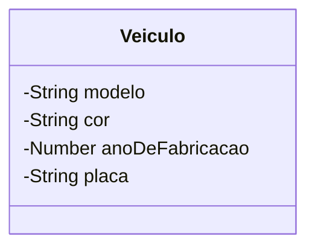

# Aprofundando os saberes sobre Membros de uma classe.

Em sala presencial, trabalhos os conceitos de **Classe, Atributos e Métodos.**

Apenas para revisar,

> **"Classe** é uma estrutura que abstrai um conjunto de objetos com características similiares. Uma classe define o **comportamento** de seus objetos através de **métodos** e os estados possíveis destes objetos através de **atributos**. Em outros termos, uma classe descreve os **serviços** providos por seus objetos e quais informações elas podem armazenar"&#x20;
>
> (https://pt.wikipedia.org/wiki/Classe\_(programação))

Por exemplo, podemos estar desenvolvendo um sistema de controle de veículos para uma empresa de seguros.

O conceito de `Veiculo` deve ser compreendido pelo sistema. Nós como desenvolvedores precisamos observar, no contexto da seguradora, quais informações e comportamentos de um veículo são relevantes para o negócio.

A sintaxe de criação de criação de Classes em Javascript (ES5+), é seguinte:

```javascript
// Criação de uma classe Veículo
class Veiculo {
    // Seção de definição dos atributos.
    // ...
    
    // Seção  de definição dos métodos.
    // ...
}
```

<figure><figcaption></figcaption></figure>

Na modelagem (projeto) de nossa classe `Veiculo`, características como: modelo, cor, ano de fabricação, placa etc. são informações que precisam ser armazenadas, representando as características do veículo. Nesse momento, estamos pensando em \*\*Atributos\*\*.

> **"Atributo** é o elemento de uma classe, responsável por definir sua estrutura de dados. O conjunto destes será responsável por representar as características e farão parte dos objetos criados a partir da classe."

Vamos adicionar alguns atributos a nossa class `Veiculo`

```javascript
// Criação de uma classe Veículo
class Veiculo {
    modelo;
    cor;
    anoDeFabricacao;
    placa;
    
    // Seção  de definição dos métodos.
    // ...
}
```


Não há declarações explícitas de tipos aos atributos em JavaScript, lembre-se que o JS é uma linguagem de tipagem fraca e dinâmica.


Podemos utilizar linguagens visuais (diagramas e esquemáticos) para representar a nossa Classe, utilizando a linguagem UML. Assim, temos o seguinte diagrama de Classe UML para nosso _code snippet_ :




Sintaxe para atributos em Javascript
