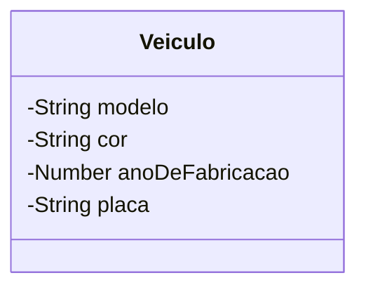

# Aprofundando os saberes sobre Membros de uma classe.

Em sala presencial, trabalhos os conceitos de **Classe, Atributos e Métodos.**

Apenas para revisar,

> **"Classe** é uma estrutura que abstrai um conjunto de objetos com características similiares. Uma classe define o **comportamento** de seus objetos através de **métodos** e os estados possíveis destes objetos através de **atributos**. Em outros termos, uma classe descreve os **serviços** providos por seus objetos e quais informações elas podem armazenar"&#x20;
>
> (https://pt.wikipedia.org/wiki/Classe\_(programação))

Por exemplo, podemos estar desenvolvendo um sistema de controle de veículos para uma empresa de seguros.

O conceito de `Veiculo` deve ser compreendido pelo sistema. Nós como desenvolvedores precisamos observar, no contexto da seguradora, quais informações e comportamentos de um veículo são relevantes para o negócio.

A sintaxe de criação de criação de Classes em Javascript (ES5+), é seguinte:

```javascript
// Criação de uma classe Veículo
class Veiculo {
    // Seção de definição dos atributos.
    // ...
    
    // Seção  de definição dos métodos.
    // ...
}
```

<figure><figcaption></figcaption></figure>

Na modelagem (projeto) de nossa classe `Veiculo`, características como: modelo, cor, ano de fabricação, placa etc. são informações que precisam ser armazenadas, representando as características do veículo. Nesse momento, estamos pensando em \*\*Atributos\*\*.

> **"Atributo** é o elemento de uma classe, responsável por definir sua estrutura de dados. O conjunto destes será responsável por representar as características e farão parte dos objetos criados a partir da classe."

Vamos adicionar alguns atributos a nossa class `Veiculo`

```javascript
// Criação de uma classe Veículo
class Veiculo {
    modelo;
    cor;
    anoDeFabricacao;
    placa;
    
    // Seção  de definição dos métodos.
    // ...
}
```


Não há declarações explícitas de tipos aos atributos em JavaScript, lembre-se que o JS é uma linguagem de tipagem fraca e dinâmica.


Podemos utilizar linguagens visuais (diagramas e esquemáticos) para representar a nossa Classe, utilizando a linguagem UML. Assim, temos o seguinte diagrama de Classe UML para nosso _code snippet_ :




Sobre a sintaxe de declaração de atributos, podemos ainda definir que nossos veículos irão começar, salvo outras alterações, com valores padrões de modelo e cor. Para tal utilizamores a sintaxe:

```javascript
class Veiculo {
    modelo = "Honda HB20";
    cor = "branco";
    anoDeFabricacao;
    placa;
    
    // ...
}


```

### Como criar objetos a partir de Classes?

Para criar **novos** objetos a partir de **classes**, processo que chamamos de instanciação de objetos, utilizamos a sintaxe:

```javascript
let novoObjetoVeiculo = new Veiculo();
```

Aqui observamos uma nova palavra-chave da linguagem Javascript, o `new` , seguido de uma chamada a uma função construtora (o construtor da classe, _veremos com mais detalhes a frente_) com o mesmo nome da classe que criamos `Veiculo` . Nessa chamada ao construtor da classe `Veiculo` não estamos passando nenhum argumento.&#x20;

Vamos criar alguns objetos utilizando a classe `Veiculo` para nos aquecer um pouco.

<figure><figcaption></figcaption></figure>

```javascript
let gol = new Veiculo();
gol.modelo = "Gol Quadrado";
gol.cor = "vermelho";
gol.ano = 1995;
gol.placa = "FUI1995";
```

<figure><figcaption></figcaption></figure>

```javascript
let fusca = new Veiculo();
fusca.modelo = "Fusca";
fusca.cor = "azul";
fusca.ano = 1988;
fusca.placa = "XAU2000";

```

Observe que após instanciado um objeto e armazenado em uma variável, podemos acessar ( seja para leitura ou escrita) os atributos do objeto através da notação:

```
<variavel-associada-ao-objeto>.<nome-do-atributo>
```

### Visualização padrão de um objeto

Em Javascript, a representação padrão de um objeto, é dada pela exibição de seus atributos. Por exemplo, ao enviarmos o objeto associado a variável `fusca` ao método `console.log(...)` , ou seja `console.log(fusca)`, teríamos:

```json
Veiculo {
  modelo: 'Fusca',
  cor: 'azul',
  ano: 1988,
  placa: 'XAU2000'
}
```
