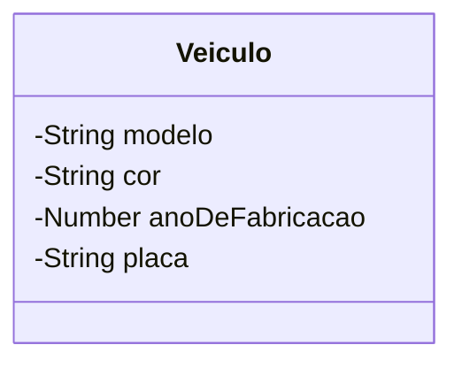

# Aprofundando os saberes sobre Membros de uma classe

Em sala presencial, trabalhos os conceitos de **Classe, Atributos e Métodos.**

Apenas para revisar,

> **"Classe** é uma estrutura que abstrai um conjunto de objetos com características similiares. Uma classe define o **comportamento** de seus objetos através de **métodos** e os estados possíveis destes objetos através de **atributos**. Em outros termos, uma classe descreve os **serviços** providos por seus objetos e quais informações elas podem armazenar"&#x20;
>
> (https://pt.wikipedia.org/wiki/Classe\_(programação))

Por exemplo, podemos estar desenvolvendo um sistema de controle de veículos para uma empresa de seguros.

O conceito de `Veiculo` deve ser compreendido pelo sistema. Nós como desenvolvedores precisamos observar, no contexto da seguradora, quais informações e comportamentos de um veículo são relevantes para o negócio.

A sintaxe de criação de criação de Classes em Javascript (ES5+), é seguinte:


```javascript
// Criação de uma classe Veículo
class Veiculo {
    // Seção de definição dos atributos.
    // ...
    
    // Seção  de definição dos métodos.
    // ...
}
```


<figure><figcaption></figcaption></figure>

Na modelagem (projeto) de nossa classe `Veiculo`, características como: modelo, cor, ano de fabricação, placa etc. são informações que precisam ser armazenadas, representando as características do veículo. Nesse momento, estamos pensando em \*\*Atributos\*\*.

> **"Atributo** é o elemento de uma classe, responsável por definir sua estrutura de dados. O conjunto destes será responsável por representar as características e farão parte dos objetos criados a partir da classe."


Vamos adicionar alguns atributos a nossa class `Veiculo`


```javascript
// Criação de uma classe Veículo
class Veiculo {
    modelo;
    cor;
    anoDeFabricacao;
    placa;
    
    // Seção  de definição dos métodos.
    // ...
}
```



Não há declarações explícitas de tipos aos atributos em JavaScript, lembre-se que o JS é uma linguagem de tipagem fraca e dinâmica.


Podemos utilizar linguagens visuais (diagramas e esquemáticos) para representar a nossa Classe, utilizando a linguagem UML. Assim, temos o seguinte diagrama de Classe UML para nosso _code snippet_ :




Sobre a sintaxe de declaração de atributos, podemos ainda definir que nossos veículos irão começar, salvo outras alterações, com valores padrões de modelo e cor. Para tal utilizamores a sintaxe:


```javascript
class Veiculo {
    modelo = "Honda HB20";
    cor = "branco";
    anoDeFabricacao;
    placa;
    
    // ...
}


```


### Como criar objetos a partir de Classes?

Para criar **novos** objetos a partir de **classes**, processo que chamamos de instanciação de objetos, utilizamos a sintaxe:

```javascript
let novoObjetoVeiculo = new Veiculo();
```

Aqui observamos uma nova palavra-chave da linguagem Javascript, o `new` , seguido de uma chamada a uma função construtora (o construtor da classe, _veremos com mais detalhes a frente_) com o mesmo nome da classe que criamos `Veiculo` . Nessa chamada ao construtor da classe `Veiculo` não estamos passando nenhum argumento.&#x20;

Vamos criar alguns objetos utilizando a classe `Veiculo` para nos aquecer um pouco.

<figure><figcaption></figcaption></figure>


```javascript
let gol = new Veiculo();
gol.modelo = "Gol Quadrado";
gol.cor = "vermelho";
gol.ano = 1995;
gol.placa = "FUI1995";
```


<figure><figcaption></figcaption></figure>


```javascript
let fusca = new Veiculo();
fusca.modelo = "Fusca";
fusca.cor = "azul";
fusca.ano = 1988;
fusca.placa = "XAU2000";

```


Observe que após instanciado um objeto e armazenado em uma variável, podemos acessar ( seja para leitura ou escrita) os atributos do objeto através da notação:

```
<variavel-associada-ao-objeto>.<nome-do-atributo>
```

### Visualização padrão de um objeto

Em Javascript, a representação padrão de um objeto, é dada pela exibição de seus atributos. Por exemplo, ao enviarmos o objeto associado a variável `fusca` ao método `console.log(...)` , ou seja `console.log(fusca)`, teríamos:


```json
Veiculo {
  modelo: 'Fusca',
  cor: 'azul',
  ano: 1988,
  placa: 'XAU2000'
}
```


### Aprofundando o Conceito de Método

Se os Atributos são os elementos de uma classe responsáveis por definir a estrutura de dados e representar as características que os objetos podem armazenar — como `modelo` ou `cor` — os Métodos definem o que o objeto faz.

Em termos formais, os métodos são responsáveis por definir o comportamento de seus objetos. Uma classe define os serviços providos por seus objetos através de métodos.

> **Método** é um porção de código que é disponibilizada pela classe. Este é executado quando é feita uma requisição a ele. Um método serve para identificar quais serviços, ações, que a classe oferece. Eles são responsáveis por definir e realizar um determinado comportamento.

Para facilitar o processo de identificação dos métodos, quando estamos pensando sobre como modelar o sistema, podemos pensar em **verbos** isso ocorre devido à sua própria definição: ações. Ou seja, quando se pensa nas ações que uma classe venha a oferecer, ela identifica seus métodos.

No processo de definição de um método, a sua **assinatura** deve ser identificada.


**Assinatura** nada mais é do que o nome do método e sua lista de parâmetros.


**Exemplo Prático:**&#x43;riando um Relatório do Veículo.

Para ilustrar o conceito de método, vamos adicionar à nossa classe `Veiculo` um comportamento que é relevante para o sistema de controle da seguradora: a capacidade de gerar um relatório ou uma descrição completa dos seus dados.

Este método utilizará as informações armazenadas nos atributos (`modelo`, `cor`, `anoDeFabricacao`, `placa`)para executar uma ação específica (neste caso, retornar uma _string_ formatada).


Relembrando a sintaxe da classe `Veiculo`:


```javascript
// Criação de uma classe Veículo 
class Veiculo {
   modelo;
   cor;
   anoDeFabricacao;
   placa;
   // Seção de definição dos métodos.
   // ...
}
```


Adicionando o método `gerarRelatorio()`:


```javascript
class Veiculo {
   modelo;
   cor;
   anoDeFabricacao;
   placa;

   // Seção de definição dos métodos.
   gerarRelatorio() {
      // O 'this' refere-se à instância atual do objeto (ex: o objeto 'fusca' ou 'gol' [6])
      let relatorio = `
      --- RELATÓRIO DO VEÍCULO ---
      Modelo: ${this.modelo}
      Cor: ${this.cor}
      Ano: ${this.anoDeFabricacao}
      Placa: ${this.placa}
      `;
      return relatorio;
   }
}
```


Ao instanciar objetos a partir desta classe e atribuir valores aos seus atributos, podemos invocar o método `gerarRelatorio()` para acessar este novo serviço:


```javascript
let fusca = new Veiculo();
fusca.modelo = "Fusca";
fusca.cor = "azul";
fusca.anoDeFabricacao = 1988;
fusca.placa = "XAU2000";

// Chamando o método para executar o comportamento
console.log(fusca.gerarRelatorio()); 

// Resultado no console seria:
/*
--- RELATÓRIO DO VEÍCULO ---
Modelo: Fusca
Cor: azul
Ano: 1988
Placa: XAU2000
*/
```


Dessa forma, o método transforma o conjunto de dados armazenados nos atributos do objeto em um serviço útil para o **negócio**.


Analogia: Se uma Classe é o projeto de um robô, os Atributos são as especificações de suas peças (cor do chassi, tipo de bateria), e os Métodos são os comandos que definem o que o robô é capaz de fazer, como "andar", "falar" ou "gerar um relatório".


### A Palavra-Chave `this` e o Conceito de Autorreferência

Ao observar o código do método `gerarRelatorio()`  percebemos o uso da palavra-chave `this` .

O que é o **this**?

A palavra-chave **this** é um mecanismo essencial dentro da Programação Orientada a Objetos, especialmente quando definimos Métodos. Dentro do contexto de um método, o **this** refere-se à instância atual do objeto que está executando aquele método (por exemplo, o objeto `fusca` ou o objeto `gol`) .

O uso do `this` configura o que chamamos de **autorreferência**.

A autorreferência permite que um objeto, a partir de seu próprio método, acesse e manipule os seus próprios atributos e defina o seu comportamento.

Quando você define a Classe Veiculo, você está dizendo: "Todo veículo que for criado terá um atributo `modelo` e um método `gerarRelatorio()`"

Quando o método é invocado (exemplo: `fusca.gerarRelatorio()`), o `this` assume a identidade daquela instância específica (o `fusca`), garantindo que o método acesse os atributos corretos (como `this.modelo`, que será "Fusca")

Portanto, o **this** é fundamental para garantir que, ao executar um método, o objeto esteja interagindo com os dados que ele mesmo armazena, e não com os dados de outras instâncias da mesma classe.&#x20;

Enquanto acessamos os atributos de fora do objeto usando a sintaxe `gol.modelo`, internamente, dentro da definição do método, o objeto se refere a si mesmo usando `this.modelo` .


### O Construtor: Inicializando o Objeto

Até agora, aprendemos que o processo de criação de novos objetos a partir de classes é chamado de instanciação e utiliza a palavra-chave `new`:


```javascript
let novoObjetoVeiculo = new Veiculo();
```


Essa sintaxe (`new Veiculo()`) é, na verdade, uma chamada a uma função construtora da classe, que possui o mesmo nome dela, embora não tenhamos detalhado seu funcionamento.

#### Definição do Construtor

O Construtor é um **tipo especial de método de uma classe** que é **executado automaticamente** toda vez que uma nova instância do objeto é criada utilizando a palavra-chave `new` .


Ele não precisa ser explicitamente chamado pelo desenvolvedor, pois o próprio processo de instanciação o aciona.


#### **Utilidade e Propósito**

A principal utilidade do Construtor é garantir que o objeto, ao ser criado, esteja em um **estado válido** imediatamente. Ele é o responsável por:

1\. Inicializar os Atributos: O construtor recebe parâmetros (dados) e os utiliza para definir os valores iniciais dos atributos do objeto.

2\. Centralizar a Criação: Ele permite que a passagem dos dados (características como `modelo`, `cor`, `placa`) seja feita no exato momento da criação, eliminando a necessidade de atribuir valor a cada atributo manualmente após a instanciação (como fizemos anteriormente).

Lembramos que, para acessar e manipular os próprios atributos dentro de um método (incluindo o construtor), utilizamos a palavra-chave **this**, configurando a autorreferência.

Exemplo Prático: Construtor na Classe `Veiculo`

Anteriormente, criávamos objetos e atribuíamos valores em múltiplas linhas:


```javascript
let gol = new Veiculo(); 
gol.modelo = "Gol Quadrado"; 
gol.cor = "vermelho"; 
// ...
```


Ao adicionar um construtor, podemos passar todos os dados relevantes em uma única linha, tornando a classe mais robusta:


```javascript
class Veiculo {
   modelo;
   cor;
   anoDeFabricacao;
   placa;

   // O CONSTRUTOR é definido. Ele recebe argumentos (parametros)
   // que serão usados para inicializar os atributos do objeto.
   constructor(modeloRecebido, corRecebida, anoRecebido, placaRecebida) {
      // Usamos o 'this' para fazer a autorreferência e atribuir os 
      // parâmetros recebidos aos atributos internos da instância.
      this.modelo = modeloRecebido; 
      this.cor = corRecebida;
      this.anoDeFabricacao = anoRecebido;
      this.placa = placaRecebida;
   }
   
   // ... (Métodos como gerarRelatorio())
}
```


**Instanciação Usando o Construtor**

\
Agora, o processo de instanciação é muito mais direto e exige que os dados sejam fornecidos no momento da chamada do construtor:


```javascript
// O construtor é chamado automaticamente e recebe os argumentos
let gol = new Veiculo("Gol Quadrado", "vermelho", 1995, "FUI1995"); 
let fusca = new Veiculo("Fusca", "azul", 1988, "XAU2000"); 

// O objeto 'gol' já está pronto e com todos os seus atributos inicializados.
console.log(gol.modelo); // Resultado: Gol Quadrado
```


O construtor transforma o ato de criar um objeto em um processo coeso e completo, garantindo que, assim que a instância existe, ela já possui suas características definidas.


Analogia: Se a Classe é uma fábrica de veiculos, a chamada `new Veiculo()` sem um construtor é como ir construindo o veiculo manualmente, decisão a decisão, peça a peça. Com o Construtor, você passa tudo o que deve ser feito (os parâmetros) no início, e a chamda a (`new Veiculo(...)`) já entrega o veículo pronto.


#### O Construtor e o Auxílio ao Encapsulamento

\
O **Encapsulamento** é um dos pilares da Programação Orientada a Objetos, focado em agrupar os dados (atributos) e os métodos que operam sobre esses dados, limitando o acesso direto à estrutura interna.&#x20;

O Construtor desempenha um papel essencial nesse princípio, atuando como o guardião da integridade do objeto desde o momento de sua criação.\
Lembre-se que atributos são os elementos de uma classe responsáveis por definir a estrutura de dados e representar as características que os objetos podem armazena.

Se permitirmos a criação de um objeto sem o construtor preenchido, somos forçados a atribuir os valores a cada atributo manualmente após a instanciação.

O construtor força a definição dos dados essenciais no exato momento da criação, prevenindo que o objeto exista em um estado inválido ou incompleto.

#### O Construtor como Validador: Garantindo a Integridade dos Dados

Vimos que o Construtor é um tipo especial de método que é executado automaticamente quando uma nova instância de objeto é criada usando a palavra-chave `new`.&#x20;

Seu objetivo primordial é inicializar os atributos do objeto, recebendo parâmetros (dados) e definindo seus valores iniciais.

No entanto, a utilidade do construtor vai além da mera atribuição de valores. Ele é o ponto de controle ideal para garantir que os dados fornecidos no momento da criação sejam **válidos**.

**A Necessidade de Validação**

Em nosso sistema de controle de veículos para a seguradora, um atributo fundamental é a `placa`. Se permitirmos que um objeto `Veiculo` seja criado com uma placa em formato incorreto ou inválido (como uma _string_ vazia ou fora dos padrões de trânsito), corremos o risco de gerar relatórios inconsistentes ou cálculos de seguro errados.

Para evitar que a instância seja criada em um estado inválido, podemos embutir a lógica de validação diretamente no construtor.

**Exemplo Prático: Validando a Placa de Trânsito**

Vamos modificar a implementação do construtor da classe `Veiculo`. Antes de usar a autorreferência (`this`) para atribuir o valor do parâmetro `placaRecebida` ao atributo interno `this.placa`, implementaremos uma checagem.

Neste exemplo, assumiremos (para fins didáticos) que uma placa válida deve ter exatamente 7 caracteres (o que simula um padrão de trânsito).


```javascript
class Veiculo {
    modelo;
    cor;
    anoDeFabricacao;
    placa;

    // O construtor agora realiza uma validação
    constructor(modeloRecebido, corRecebida, anoRecebido, placaRecebida) {

        // --- SEÇÃO DE VALIDAÇÃO ---
        const placa = placaRecebida.toUpperCase(); // Padroniza o formato

        if (placa.length !== 7) {
            // Se a validação falhar, lançamos um erro,
            // impedindo que o objeto seja criado em estado inválido.
            throw new Error(`A placa "${placaRecebida}" é inválida. Uma placa deve ter 7 caracteres.`);
        }
        // --------------------------

        // Se a validação for bem-sucedida, inicializamos os atributos
        this.modelo = modeloRecebido;
        this.cor = corRecebida;
        this.anoDeFabricacao = anoRecebido;
        this.placa = placa; 
    }
    
    // ... (Métodos como gerarRelatorio)
}
```


**Instanciação com Validação**

Ao tentarmos instanciar um objeto agora, o construtor executa a lógica de validação antes de prosseguir com a inicialização:

Dessa forma, o construtor atua como um **portão de segurança (ou&#x20;**_**guard clause**_**)**, assegurando que qualquer objeto instanciado a partir da classe `Veiculo` já comece sua existência com os dados essenciais (como a placa) em um formato coerente com as regras do negócio.
