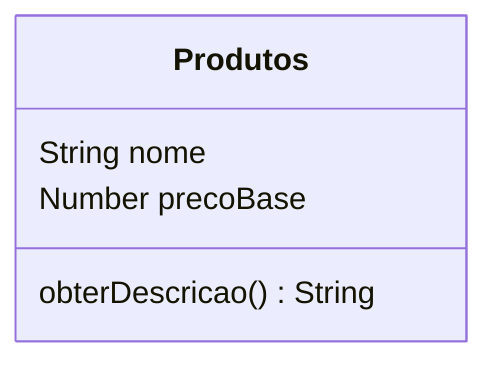

# Avaliação de POO - N2

## Avaliação de POO com JavaScript: Sistema de E-commerce

Instruções: Leia atentamente o cenário abaixo e responda às questões. O foco é a aplicação correta dos pilares da Orientação a Objetos e a sintaxe moderna do JavaScript (ES6+).

***

### **Questão 1: Modelagem e Abstração**

Cenário: Você está desenvolvendo o núcleo de um E-commerce. O sistema possui **Produtos** Genéricos (que têm **nome** e **preço base**) e um **método para recuperar a descrição do produto**. No entanto, o sistema vende dois tipos específicos de produtos:

1. **Produto Físico**: Possui um **peso (em kg)** e um **método para calcular frete** (custo fixo \* peso).
2. **Produto Digital**: Possui um **tamanho de arquivo (em MB)** e um l**ink de download**.

Além disso, existe o **Carrinho de Compras**, que deve armazenar uma lista de produtos adicionados e ser capaz de **calcular o valor total da compra**.

Tarefa: Descreva, textual ou esquematicamente, as classes necessárias (Nome da Classe), seus atributos (propriedades) e métodos (comportamentos) essenciais para atender a este cenário.

Exemplo:

> * Classe `Produto` (Abstrata/Base):
>   * _Atributos:_ `nome`, `preco`.
>   * _Métodos:_ `obterDescricao().`

***

### **Questão 2: Identificação de Relações**

Tarefa: Com base no cenário da Questão 1, identifique explicitamente onde ocorre:

1. Uma **relação de Herança** ("É um"). Justifique sua resposta brevemente.
2. Uma **relação de Composição/Agregação ("Tem um" ou "Contém vários")**. Justifique sua resposta brevemente.

***

### **Questão 3: Implementação (JavaScript Moderno)**

Tarefa: Implemente as classes projetadas utilizando JavaScript (ES6+). Requisitos técnicos:

* Utilize `extends` e `super` corretamente.
* No `Carrinho`, utilize um campo privado (sintaxe `#`) para armazenar a lista de produtos, garantindo encapsulamento.
* Implemente um método no Carrinho que use um loop eficiente para calcular o total.

### **Questão 4: Testes e Lógica de Consumo**

Tarefa: Traduza o pseudocódigo abaixo para uma função de teste em JavaScript que utilize as classes criadas na Questão 3.

> Pseudocódigo:
>
> 1. Crie uma função chamada `executarCompra`.
> 2. Instancie um `ProdutoFisico` ("Teclado Mecânico", custa 150, peso 1kg).
> 3. Instancie um `Produto` genérico ou Digital ("E-book JS", custa 50).
> 4. Instancie um novo `Carrinho`.
> 5. Adicione os dois produtos ao carrinho.
> 6. Exiba no console o texto: "Total da compra: R$" concatenado com o resultado do método de calcular total do carrinho.

