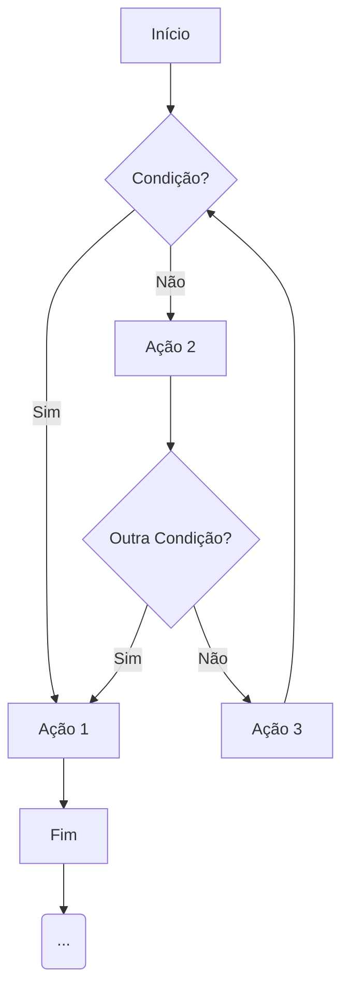
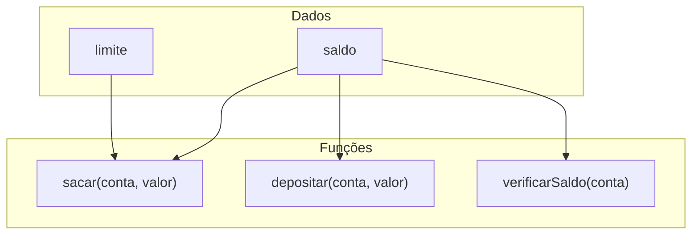
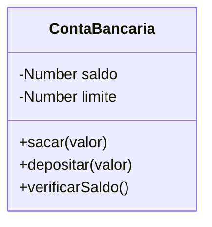

# Paradigmas de Programação

### O Início: Programação Não Estruturada (Anos 50-60)

Nos primórdios da programação, o código era uma longa sequência de comandos. O fluxo era controlado por um comando chamado `GOTO`, que pulava a execução para qualquer outra linha do programa.

Isso gerava o famoso **"código espaguete"**: um emaranhado de saltos, difícil de ler, depurar e manter.

_Um fluxo caótico e difícil de seguir._

<figure><figcaption></figcaption></figure>

***

### A Evolução: Programação Estruturada (Anos 70)

Para combater o caos, surgiu a **Programação Estruturada**. A regra era clara: **abolir o `GOTO`**!

<figure><figcaption></figcaption></figure>

O foco passou a ser em um fluxo de controle lógico e previsível, baseado em três estruturas fundamentais:

* **Sequência:** Executar instruções uma após a outra.
* **Seleção:** Tomar decisões com `if / else / switch`.
* **Iteração:** Repetir blocos de código com `for / while`.

O código passou a ser organizado em **funções** (ou procedimentos), cada uma com uma responsabilidade única.

***

### Programação Estruturada _Dados e Funções Separados_

***

### O Limite da Programação Estruturada

**A programação estruturada foi uma revolução. Linguagens como C e Pascal dominaram o cenário**. O código ficou mais limpo.

Mas surgiu um novo problema: os sistemas estavam ficando gigantescos (sistemas operacionais, grandes sistemas comerciais).

Nesse paradigma, dados e as funções que operavam nesses dados viviam separados. Conforme o sistema crescia, gerenciar a relação entre eles virava um pesadelo. Uma mudança em uma estrutura de dados podia exigir alterações em dezenas de funções espalhadas pelo código.

***

### A Mudança de Mentalidade: Orientação a Objetos (Anos 80-90)

A POO (OOP) propôs uma mudança radical de perspectiva.

Em vez de pensar primeiro nas ações (funções), começamos a pensar nas "coisas" (objetos) do nosso sistema.

A ideia central é agrupar os dados e as funções que manipulam esses dados em uma única entidade: o Objeto.

Isso se chama **Encapsulamento**. Ele **"esconde" a complexidade e protege os dados**, expondo apenas operações seguras. O código passa a ser uma coleção de objetos que se comunicam entre si.

