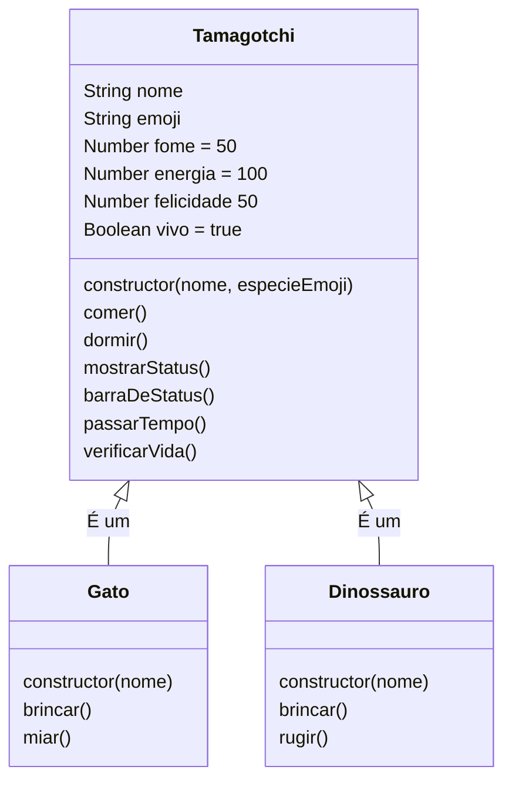

# Exercício de Herança (Tamagochi)

<p align="center"></p>

***

### 🐣 O Retorno do Bichinho Virtual

De volta aos anos 90, direto no seu Terminal.

Quem cresceu nos anos 90 ou início dos anos 2000 conhece bem a ansiedade de manter um serzinho pixelado vivo. Eram três botões, uma tela monocromática e uma responsabilidade imensa. A gente levava para a escola escondido na mochila, rezando para ele não apitar de fome no meio da aula de matemática. Se você esquecesse dele, encontrava um túmulo pixelado no final do dia.

Aquela pequena peça de plástico nos ensinou sobre Estado (Fome, Felicidade), Ciclo de Vida (Nascer, Viver, Morrer) e Eventos (O que acontece quando aperto um botão?).

Hoje, como desenvolvedores, nós vamos olhar para dentro daquela "caixa preta". Vamos descobrir que a mágica não era feitiçaria, era Orientação a Objetos. Vamos recriar essa experiência usando tecnologias modernas, trocando o chaveiro de plástico pelo Deno e a tela de cristal líquido pelo nosso Terminal Linux.

#### O Desafio Técnica

Neste projeto, não vamos apenas escrever código; vamos modelar a vida (virtual). Para isso, usaremos três pilares fundamentais:

1. Abstração: Criar um modelo genérico de "Bichinho" (`Tamagotchi`).
2. Herança: Criar espécies específicas (`Gato`, `Dinossauro`) que aproveitam o código do modelo genérico.
3. Polimorfismo: Fazer com que cada espécie reaja de forma única à mesma ação de "Brincar".

***

### 🗺️ O Mapa do Código: Diagrama de Classes

Antes de olhar para as linhas de código, vamos entender a estrutura do nosso sistema.

Imagine que a classe `Tamagotchi` é uma planta baixa (blueprint). As classes `Gato` e `Dinossauro` usam essa mesma planta, mas adicionam suas próprias decorações e puxadinhos.

Abaixo, temos o Diagrama UML que representa exatamente o código que escrevemos:



### 💻 A Implementação (Deno Edition)

Crie um arquivo chamado `tamagotchi.js` e cole o código abaixo.

JavaScript

```
/**
 * 🎮 TERMINAL-GOTCHI (Deno Version)
 * Autor: Bernardo & Gemini
 * * Conceitos: Classes, Herança (extends), Polimorfismo e Encapsulamento de Lógica.
 * Como rodar: deno run tamagotchi.js
 */

// ==========================================
// 1. A CLASSE MÃE (Superclasse)
// ==========================================
class Tamagotchi {
    constructor(nome, especieEmoji) {
        this.nome = nome;
        this.emoji = especieEmoji;
        // Estado inicial
        this.fome = 50; 
        this.energia = 100;
        this.felicidade = 50;
        this.vivo = true;
    }

    // --- Comportamentos Genéricos (Todos herdam) ---

    comer() {
        if (!this.verificarVida()) return;
        
        this.fome -= 20;
        this.energia -= 5;
        // Garante que a fome não fique negativa
        if (this.fome < 0) this.fome = 0;
        
        console.log(`${this.emoji} ${this.nome} comeu uma fruta gostosa! 🍎 (Nhac!)`);
        this.passarTempo();
    }

    dormir() {
        if (!this.verificarVida()) return;
        
        this.energia = 100; // Recupera tudo
        this.fome += 10;    // Acorda com fome
        
        console.log(`${this.emoji} ${this.nome} tirou uma soneca... Zzz 💤`);
        this.passarTempo();
    }

    // O método mostrarStatus desenha a interface no terminal
    mostrarStatus() {
        if (!this.vivo) {
            console.log(`\n💀 ${this.nome} partiu dessa para melhor...`);
            return;
        }

        console.log(`\n--- STATUS DE ${this.nome.toUpperCase()} ${this.emoji} ---`);
        console.log(`🍗 Fome:       ${this.gerarBarra(this.fome, true)} (${this.fome}%)`); 
        console.log(`⚡ Energia:    ${this.gerarBarra(this.energia)} (${this.energia}%)`);
        console.log(`😄 Felicidade: ${this.gerarBarra(this.felicidade)} (${this.felicidade}%)`);
        console.log(`------------------------------`);
    }

    // Método auxiliar visual (Privado na lógica, público no uso didático)
    gerarBarra(valor, invertido = false) {
        const total = 10;
        // Normaliza valores entre 0 e 100 para escala de 0 a 10
        const preenchido = Math.round(Math.max(0, Math.min(100, valor)) / 10);
        const vazio = total - preenchido;
        
        // Lógica ternária para escolher a cor do bloco
        const bloco = invertido 
            ? (valor > 80 ? '🟥' : valor > 50 ? '🟨' : '🟩') // Invertido: Muito é ruim (Fome)
            : (valor < 20 ? '🟥' : valor < 50 ? '🟨' : '🟩'); // Normal: Pouco é ruim (Energia)

        return bloco.repeat(preenchido) + '⬜'.repeat(vazio);
    }

    // Simula o passar do tempo a cada ação
    passarTempo() {
        this.fome += 5;
        this.felicidade -= 5;
        this.energia -= 5;
        this.verificarVida();
    }

    // Checa se o bichinho morreu
    verificarVida() {
        if (this.fome >= 100 || this.energia <= 0) {
            this.vivo = false;
            console.log(`\n👻 Oh não! ${this.nome} não resistiu... Game Over.`);
            return false;
        }
        return true;
    }
}

// ==========================================
// 2. AS CLASSES FILHAS (Herança)
// ==========================================

class Gato extends Tamagotchi {
    constructor(nome) {
        // 'super' chama o construtor da classe Tamagotchi
        super(nome, '🐱'); 
    }

    // Polimorfismo: O Gato brinca de um jeito específico
    brincar() {
        if (!this.verificarVida()) return;
        this.felicidade += 20;
        this.fome += 10;
        this.energia -= 15;
        console.log(`${this.emoji} ${this.nome} brincou com o novelo de lã! 🧶`);
        this.passarTempo();
    }

    // Método exclusivo
    miar() {
        console.log(`${this.emoji} ${this.nome}: Miau! Miau! 🎵`);
    }
}

class Dinossauro extends Tamagotchi {
    constructor(nome) {
        super(nome, '🦖');
    }

    // Polimorfismo: O Dino brinca de outro jeito
    brincar() {
        if (!this.verificarVida()) return;
        this.felicidade += 15;
        this.fome += 20;
        this.energia -= 20;
        console.log(`${this.emoji} ${this.nome} destruiu uma cidade de brinquedo! 🔥🏙️`);
        this.passarTempo();
    }

    // Método exclusivo
    rugir() {
        console.log(`${this.emoji} ${this.nome}: ROOOAAAR!!! 🌋`);
    }
}

// ==========================================
// 3. GAME LOOP (Interface Deno)
// ==========================================

console.clear();
console.log("🎮 BEM-VINDO AO TERMINAL-GOTCHI 🎮");
console.log("Recriando a nostalgia com Deno e OOP.\n");

// Entrada de dados síncrona (exclusivo do Deno/Web API)
const tipo = prompt('Escolha seu pet (1 para Gato 🐱, 2 para Dino 🦖):');
const nome = prompt('Qual o nome dele?') || "Bichinho";

let pet;

// Factory simples
if (tipo === '1') {
    pet = new Gato(nome);
} else {
    pet = new Dinossauro(nome);
}

console.clear();
console.log(`🥚 Um ovo chocou! Nasceu ${pet.nome}, o ${pet.constructor.name}!`);

// Loop principal do jogo
while (pet.vivo) {
    pet.mostrarStatus();
    
    // Define a ação especial baseado no tipo da instância
    const acaoEspecial = (pet instanceof Gato) ? "4. Miar 🎵" : "4. Rugir 🌋";

    console.log(`Ações:`);
    console.log(`1. Comer 🍎  | 2. Dormir 💤`);
    console.log(`3. Brincar 🎾 | ${acaoEspecial}`);
    console.log(`5. Sair ❌`);

    const escolha = prompt('\n>> O que você vai fazer? ');
    console.clear();

    if (escolha === '5' || escolha === null) {
        console.log("Até a próxima! 👋");
        break;
    }

    switch(escolha) {
        case '1': pet.comer(); break;
        case '2': pet.dormir(); break;
        case '3': pet.brincar(); break; // O método correto será chamado automaticamente
        case '4': 
            if (pet instanceof Gato) pet.miar();
            else pet.rugir();
            break;
        default: console.log("⚠️ Opção inválida!");
    }
}
```

#### Próximos Passos para o Aluno

Para tornar a aula interativa, após rodarem o código, você pode lançar o desafio:

* _"E se quisermos criar um Robô (`🤖`) que não come comida orgânica, mas precisa de `recarregarBateria()` em vez de dormir? Como a herança nos ajuda (ou atrapalha) aqui?"_
