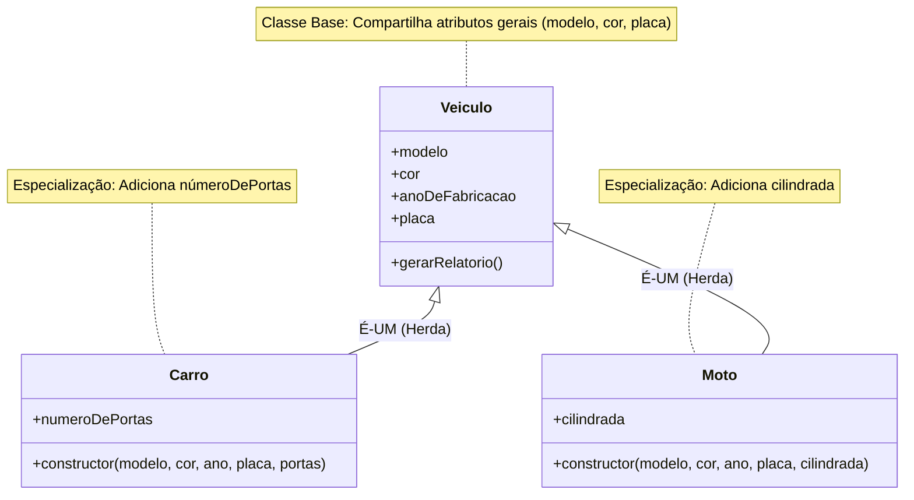
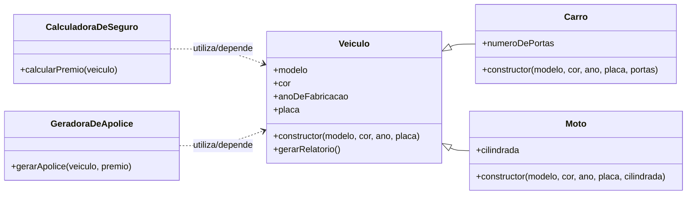

# Herança

## O Conceito de Herança


Para entender a herança, vamos primeiro observar como a ciência organiza a vida. A Taxonomia é o sistema de classificação que agrupa os seres vivos com base em suas semelhanças. Na biologia, ela é fundamental porque organiza a biodiversidade em uma estrutura hierárquica, permitindo que cientistas entendam as relações de parentesco e características comuns sem precisar descrever cada detalhe básico repetidamente para cada espécie.

Essa mesma lógica de organização eficiente é a base da Programação Orientada a Objetos. As nossas fontes definem que a Herança estabelece uma Hierarquia de Classes, onde a classe mais genérica fica no topo e as mais específicas abaixo.

• **Na Biologia**: Se sabemos que um animal é um _Mamífero_, não precisamos perguntar se ele amamenta; essa característica já foi herdada do grupo acima.

• **Na Programação**: Como vimos no nosso sistema, um `Carro` e uma `Moto` são fundamentalmente `Veiculos` e compartilham características básicas como modelo e cor.

A grande vantagem disso, tanto na natureza quanto no código, **é evitar a repetição**. Em vez de reescrevermos todos os atributos para cada novo tipo, utilizamos a herança para garantir o reuso de código, focando apenas no que é específico daquela nova "espécie" de objeto


**Curiosidade - Taxonomia Humana**

Vocês lembram das aulas de biologia?

A classificação da nossa espécie, o _Homo sapiens_, segue uma hierarquia rigorosa onde herdamos características de grupos maiores. Vamos visualizar:

1. Reino: Animalia (Somos animais, logo, nos movemos e consumimos oxigênio).
2. Filo: Chordata (Temos coluna vertebral).
3. Classe: Mammalia (Temos pelos e glândulas mamárias).
4. Ordem: Primates (Temos polegares opositores).
5. Família: Hominidae (ausência de cauda externa, desenvolvimento cognitivo elevado).
6. Gênero: Homo (andar ereto e bípede, cultura e ferramentas)
7. Espécie: Sapiens (Pensamento abstrato)

Qual é a lógica aqui? Nós não precisamos redefinir que temos "coluna vertebral" quando chegamos na classificação de _Sapiens_. Nós herdamos essa característica do grupo acima (Filo). Isso evita que a natureza tenha que "reinventar a roda" para cada nova espécie.




<figure><figcaption><p>Ilustração dos conceitos de Generalização e Especialização.</p></figcaption></figure>

Até agora, definimos que uma Classe é uma estrutura que abstrai um conjunto de objetos com características similares. Por exemplo, a classe `Veiculo` possui atributos como `modelo`, `cor`, `anoDeFabricacao` e `placa`, e comportamentos como o método `gerarRelatorio()`.

No entanto, no nosso sistema da seguradora, um `Carro` e uma `Moto` são, fundamentalmente, Veículos.

&#x20;Eles compartilham as características básicas (modelo, cor, placa), mas também possuem características ou comportamentos específicos (um carro tem número de portas, uma moto pode ter a cilindrada).

A **Herança** é o mecanismo da Programação Orientada a Objetos (POO) que permite que uma nova classe (chamada **subclasse** ou **classe filha**) **herde os atributos e métodos** de uma classe existente (chamada **superclasse** ou **classe pai**).

Este conceito se baseia na relação "É-UM":

• Um Carro _É-UM_ `Veiculo`.

• Uma Moto _É-UM_ `Veiculo`.

### A Importância da Herança: Reuso de Código

Embora existam diversos mecanismos para evitar a repetição de lógica (como a composição e o uso de interfaces), a herança destaca-se como o caminho sintaticamente mais direto e intuitivo para promover o reuso em Programação Orientada a Objetos.

Imagine que a classe `Veiculo` possua dez atributos e cinco métodos (incluindo o construtor e o `gerarRelatorio()`). **Sem a herança**, ao criarmos a classe `Carro` e a classe `Moto`, **teríamos que reescrever todos esses quinze membros em cada nova classe**.

Com a herança, a classe filha (como `Carro`) automaticamente ganha acesso a todos os atributos e métodos definidos na classe pai (`Veiculo`), precisando apenas implementar aquilo que é novo ou específico de sua especialização. Isso torna o código mais limpo, fácil de manter e mais consistente.

### Criação de uma Hierarquia de Classes

A Herança estabelece uma Hierarquia de Classes, onde a classe mais genérica está no topo e as classes mais específicas estão abaixo.

A classe `Veiculo` se torna a Classe Base ou Superclasse. As classes `Carro` e `Moto` se tornam as Classes Derivadas ou Subclasses, **especializando** o comportamento e os dados de `Veiculo`.



### **Sintaxe da Herança no JavaScript Moderno**

Para implementar a herança no JavaScript moderno (ES6+), utilizamos a palavra-chave **extends** na declaração da classe filha.

**Utilizando a Classe Base `Veiculo`**&#x20;

Relembramos a estrutura da nossa classe `Veiculo`, que usa o construtor para inicializar os atributos.


```javascript
class Veiculo {
    modelo;
    cor;
    anoDeFabricacao;
    placa;

    constructor(modelo, cor, ano, placa) {/* implementação */}
    gerarRelatorio() {/* implementação */}
}
```


**Especialização 1: Classe `Carro`**

A classe `Carro` herda todas as características de `Veiculo`, mas adiciona o atributo específico `numeroDePortas`.

Para garantir que a **inicialização** do `Veiculo` seja feita corretamente, o construtor da classe filha (`Carro`) deve chamar o construtor da classe pai (`Veiculo`) usando a palavra-chave `super()` .


```javascript
class Carro extends Veiculo {
    // Atributo específico do Carro
    numeroDePortas;

    // O construtor do Carro recebe todos os parâmetros do Veiculo
    // MAIS os parâmetros específicos (numeroDePortas).
    constructor(modelo, cor, ano, placa, portas) {
        
        // 1. CHAMA O CONSTRUTOR PAI:
        // 'super()' envia os parâmetros genéricos (Veiculo) ao construtor da classe Veiculo.
        super(modelo, cor, ano, placa); 

        // 2. INICIALIZA ATRIBUTOS PRÓPRIOS:
        // Depois de chamar o super, inicializamos os atributos específicos do Carro.
        this.numeroDePortas = portas;
    }
}
```


Especialização 2: Classe `Moto`&#x20;

A classe `Moto` também herda de `Veiculo`, mas adiciona o atributo `cilindrada`.


```javascript
class Moto extends Veiculo {
    // Atributo específico da Moto
    cilindrada; 

    constructor(modelo, cor, ano, placa, cilindradaRecebida) {
        
        // 1. CHAMA O CONSTRUTOR PAI: 
        super(modelo, cor, ano, placa); 

        // 2. INICIALIZA ATRIBUTOS PRÓPRIOS:
        this.cilindrada = cilindradaRecebida;
    }
}
```


**Testando a Hierarquia e o Reuso**

Ao criarmos instâncias das classes especializadas, observamos o reuso em ação:


```javascript
// Instanciação de um Carro
let meuCarro = new Carro("Corsa", "cinza", 2005, "ABC1234", 4);

// O Carro utiliza o método herdado de Veiculo
console.log(meuCarro.gerarRelatorio()); 
/* 
Resultado (herdado do Veiculo): 
--- RELATÓRIO DO VEÍCULO ---
Modelo: Corsa
Cor: cinza
Ano: 2005
Placa: ABC1234
*/

// O Carro possui seu atributo especializado
console.log(meuCarro.numeroDePortas); // Resultado: 4
```


A instância de `Carro` conseguiu utilizar o método `gerarRelatorio()` que foi escrito apenas uma vez, na classe `Veiculo`, provando o reuso.

O construtor garante o estado válido da parte `Veiculo` do objeto, enquanto o construtor da subclasse garante o estado válido da parte especializada (`Carro` ou `Moto`).

### Nossas classes até aqui

É fundamental consolidar visualmente todas as classes que foram desenvolvidas para o sistema de controle de veículos da seguradora, incluindo a hierarquia de herança e a interação.


