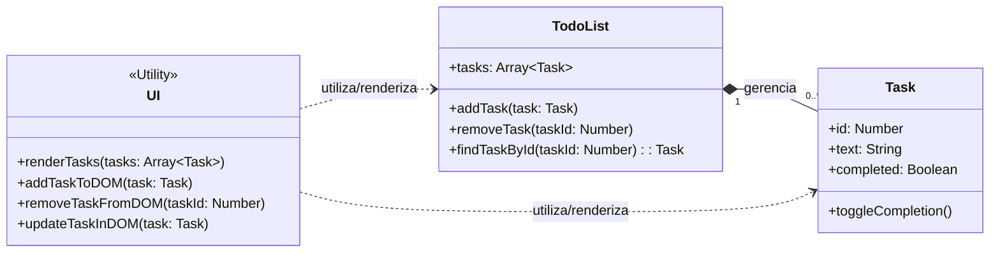
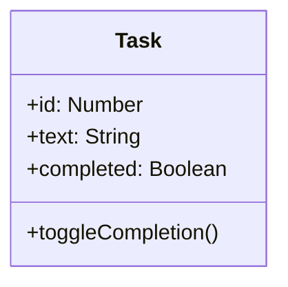
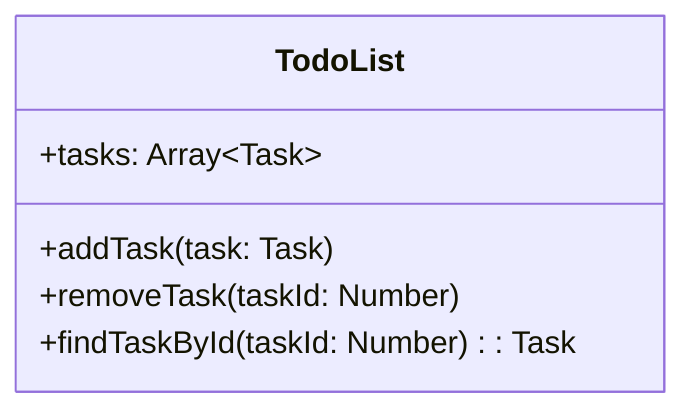
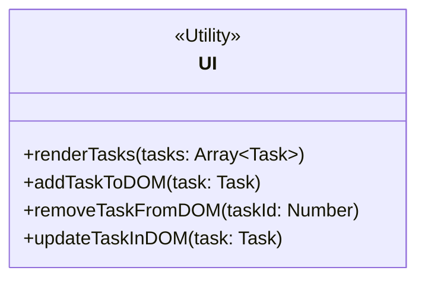

# Implementando uma To-do list (Gerenciador de Tarefas)

**Por que a Lista de Tarefas é um Exercício Tão Popular?**

A popularidade não é por acaso. O projeto atinge um ponto de equilíbrio perfeito entre simplicidade e potencial de complexidade, tornando-o ideal para aprender e aplicar uma vasta gama de conceitos.

1. **Relatabilidade e Simplicidade Conceitual:** Todo mundo entende o que é uma lista de tarefas. Não é preciso explicar regras de negócio complexas ou conceitos abstratos. O objetivo é claro desde o início: adicionar, visualizar, marcar como concluído e remover itens de uma lista.
2. **Escopo Definido**, mas Flexível:
   * Versão Mínima Viável (MVP): Em sua forma mais simples, pode ser feita em poucas horas, exigindo apenas um campo de texto, um botão e uma lista.
   * Potencial de Expansão: É incrivelmente fácil adicionar novas funcionalidades (edição, prazos, prioridades, filtros, etc.), permitindo que o projeto cresça junto com o conhecimento do desenvolvedor.
3. **Cobre os Fundamentos Essenciais (CRUD)**: A lista de tarefas é, essencialmente, a primeira experiência de muitos desenvolvedores com operações CRUD, que são a base da maioria das aplicações no mundo real:
   * Create (Criar): Adicionar uma nova tarefa à lista.
   * Read (Ler): Exibir todas as tarefas na tela.
   * Update (Atualizar): Marcar uma tarefa como concluída ou editar seu texto.
   * Delete (Deletar): Remover uma tarefa da lista.
4. **Feedback Visual Imediato**: Para quem está aprendendo, ver o resultado do seu código instantaneamente na tela é extremamente motivador. Adicionar uma tarefa e vê-la aparecer na lista, ou clicar em um botão e vê-la desaparecer, cria um ciclo de aprendizado rápido e gratificante.

***

<mark style="background-color:$success;">Enquanto o exercício da "Lista de Tarefas" pode ser resolvido de forma puramente procedural, a nossa implementação teve como foco principal utilizá-lo como uma ferramenta prática para ensinar e solidificar os conceitos da Programação Orientada a Objetos (POO).</mark>

***

### **Aplicação de Lista de Tarefa demonstrativa**

[https://g.co/gemini/share/4bd83a3a5842](https://g.co/gemini/share/4bd83a3a5842)

***


A modelagem OO consiste em identificar os "substantivos" ou "conceitos" do nosso problema e transformá-los em classes. Para uma lista de tarefas, os conceitos principais são:

1. A **Tarefa** em si.
2. A **Lista de Tarefas**, que gerencia o conjunto de tarefas.
3. A **Interface de Usuário**, responsável por desenhar tudo na tela.



***

#### 1. A Classe `Task` (A Entidade Principal)

Conceito Associado: Encapsulamento

Esta é a classe mais fundamental do nosso sistema. Ela representa uma única tarefa. O princípio do encapsulamento é chave aqui: a classe `Task` agrupa todos os dados (atributos) e comportamentos (métodos) relacionados a uma única tarefa em um só lugar. Um objeto `Task` é autônomo; ele sabe tudo sobre si mesmo (seu texto, seu estado de conclusão), mas não precisa saber sobre a lista que o contém ou a interface que o exibe.

Responsabilidades:

* Saber (Atributos): Seu identificador único, seu texto descritivo e se já foi concluída ou não.
* Fazer (Métodos): Alterar seu próprio estado de conclusão.



Análise do Diagrama:

* `class Task`: Define o "molde" para qualquer tarefa.
* `+Number id`: Um atributo público (`+`) para identificar unicamente a tarefa.
* `+String text`: O atributo que guarda a descrição da tarefa.
* `+Boolean completed`: O atributo que guarda o estado (concluída ou pendente).
* `+toggleCompletion()`: Um método público que inverte o valor do atributo `completed`.

***

#### 2. A Classe `TodoList` (A Gerenciadora)

Conceito Associado: Agregação/Composição e Separação de Responsabilidades

Esta classe atua como a "gerenciadora" ou "controladora" da nossa aplicação. Sua principal responsabilidade é gerenciar a coleção de objetos `Task`. Ela não sabe como desenhar uma tarefa na tela nem os detalhes internos de uma tarefa, apenas como adicioná-la, removê-la e encontrá-la na coleção.

Isso demonstra a Separação de Responsabilidades: a `TodoList` cuida da lógica de negócio (gerenciar a coleção), enquanto a `Task` cuida dos dados de uma única tarefa. A relação entre `TodoList` e `Task` é de Composição, pois uma `TodoList` "é composta por" várias `Task`s.

Responsabilidades:

* Saber (Atributos): A lista completa de todas as tarefas existentes.
* Fazer (Métodos): Adicionar uma nova tarefa à lista, remover uma tarefa existente e encontrar uma tarefa específica.



Análise do Diagrama:

* `+Array<Task> tasks`: O atributo mais importante. É um array (`Array`) que conterá exclusivamente (`<Task>`) objetos da classe `Task`.
* `+addTask(task: Task)`: Método que recebe um objeto `Task` e o adiciona ao array `tasks`.
* `+removeTask(taskId: Number)`: Método que recebe o `id` de uma tarefa para encontrá-la e removê-la do array.
* `+findTaskById(taskId: Number): Task`: Método que busca e retorna (`: Task`) uma tarefa específica pelo seu `id`.

***


#### 3. A Classe `UI` (A Camada de Apresentação)

Conceito Associado: Separação de Responsabilidades (View Layer)

Esta classe é um exemplo perfeito de como isolar responsabilidades. Sua única e exclusiva função é manipular o DOM (a página HTML). Ela não contém nenhuma lógica de negócio. Ela não sabe o que é uma lista de tarefas, apenas recebe dados e os "desenha" na tela, ou captura um clique e informa a outra parte do sistema.

Por ser uma classe que apenas agrupa funções úteis e não precisa guardar estado (atributos), seus métodos são estáticos. Isso significa que não precisamos criar uma instância dela (com `new UI()`), podemos apenas chamar seus métodos diretamente: `UI.render()`.

Responsabilidades:

* Fazer (Métodos): Renderizar a lista inteira de tarefas, adicionar uma nova tarefa ao HTML, remover uma tarefa do HTML e atualizar a aparência de uma tarefa (ex: aplicar um estilo de "riscado" quando concluída).




***

### Sugestão de Implementação

```javascript
/**
 * CLASSE: Task
 * CONCEITO: Encapsulamento de uma única tarefa.
 * RESPONSABILIDADE: Saber seus próprios dados e gerenciar seu próprio estado de conclusão.
 */
class Task {
    constructor(text) {
        this.id = Date.now(); // Timestamp como ID único e simples
        this.text = text;
        this.completed = false;
        this.createdAt = new Date();
    }

    toggleCompletion() {
        this.completed = !this.completed;
    }
}


/**
 * CLASSE: TodoList
 * CONCEITO: Gerenciamento da coleção de tarefas (lógica de negócio).
 * RESPONSABILIDADE: Adicionar, remover e encontrar tarefas.
 */
class TodoList {
    constructor() {
        // Tenta carregar do localStorage ou começa com um array vazio.
        // O `map` garante que os objetos recuperados sejam instâncias da classe Task,
        // restaurando o acesso a métodos como `toggleCompletion`.
        const tasksFromStorage = JSON.parse(localStorage.getItem('tasks')) || [];
        this.tasks = tasksFromStorage.map(taskData => {
            const task = new Task(taskData.text);
            task.id = taskData.id;
            task.completed = taskData.completed;
            task.createdAt = new Date(taskData.createdAt);
            return task;
        });
    }

    _saveToLocalStorage() {
        localStorage.setItem('tasks', JSON.stringify(this.tasks));
    }

    addTask(text) {
        if (typeof text !== 'string' || text.trim() === '') {
            console.error("O texto da tarefa não pode ser vazio.");
            return;
        }
        const newTask = new Task(text);
        this.tasks.push(newTask);
        this._saveToLocalStorage();
        return newTask;
    }

    removeTask(taskId) {
        this.tasks = this.tasks.filter(task => task.id !== taskId);
        this._saveToLocalStorage();
    }


    findTaskById(taskId) {
        return this.tasks.find(task => task.id === taskId);
    }
    
    // Método para alternar o status e salvar
    toggleTask(taskId){
        const task = this.findTaskById(taskId);
        if(task){
            task.toggleCompletion();
            this._saveToLocalStorage();
        }
        return task;
    }
}


/**
 * CLASSE: UI
 * CONCEITO: Separação de responsabilidades (camada de apresentação).
 * RESPONSABILIDADE: Exclusivamente manipular o DOM. Todos os métodos são estáticos.
 */
class UI {
    static renderTasks(tasks) {
        const taskListElement = document.getElementById('task-list');
        // Limpa a lista antes de renderizar para evitar duplicatas
        taskListElement.innerHTML = ''; 

        if (tasks.length === 0) {
            taskListElement.innerHTML = `<li class="empty-list">Nenhuma tarefa por aqui!</li>`;
            return;
        }

        tasks.forEach(task => {
            this.addTaskToDOM(task);
        });
    }

    static addTaskToDOM(task) {
        const taskListElement = document.getElementById('task-list');

        // Remove a mensagem de lista vazia, se existir
        const emptyListMessage = taskListElement.querySelector('.empty-list');
        if (emptyListMessage) {
            emptyListMessage.remove();
        }

        const listItem = document.createElement('li');
        listItem.classList.add('task-item');
        listItem.setAttribute('data-id', task.id);

        if (task.completed) {
            listItem.classList.add('completed');
        }

        listItem.innerHTML = `
            <span class="task-text">${task.text}</span>
            <button class="delete-btn">✖</button>
        `;
        taskListElement.appendChild(listItem);
    }

    static removeTaskFromDOM(taskId) {
        const taskItem = document.querySelector(`.task-item[data-id="${taskId}"]`);
        if (taskItem) {
            taskItem.remove();
        }
    }
    
    static updateTaskInDOM(task) {
        const taskItem = document.querySelector(`.task-item[data-id="${task.id}"]`);
        if (taskItem) {
            if (task.completed) {
                taskItem.classList.add('completed');
            } else {
                taskItem.classList.remove('completed');
            }
        }
    }

    static clearInputField() {
        document.getElementById('task-input').value = '';
    }
}


// ===================================================================
// INICIALIZAÇÃO DA APLICAÇÃO E EVENT LISTENERS
// Esta parte do código "conecta" as classes e a interação do usuário.
// ===================================================================

document.addEventListener('DOMContentLoaded', () => {

    const todoList = new TodoList();
    const taskForm = document.getElementById('task-form');
    const taskInput = document.getElementById('task-input');
    const taskListElement = document.getElementById('task-list');

    // Renderiza as tarefas iniciais que estão no localStorage
    UI.renderTasks(todoList.tasks);

    // Evento para ADICIONAR uma nova tarefa
    taskForm.addEventListener('submit', (e) => {
        e.preventDefault();
        const text = taskInput.value;
        const newTask = todoList.addTask(text);
        if (newTask) {
            UI.addTaskToDOM(newTask);
            UI.clearInputField();
        }
    });

    // Evento para REMOVER ou COMPLETAR uma tarefa (usando delegação de eventos)
    taskListElement.addEventListener('click', (e) => {
        const target = e.target;
        const taskItem = target.closest('.task-item');

        if (!taskItem) return; // Sai se o clique não foi dentro de um item de tarefa

        const taskId = Number(taskItem.getAttribute('data-id'));

        // Lógica para REMOVER
        if (target.classList.contains('delete-btn')) {
            todoList.removeTask(taskId);
            UI.removeTaskFromDOM(taskId);
            // Se a lista ficar vazia após remover, mostra a mensagem
            if (todoList.tasks.length === 0) {
                 UI.renderTasks([]);
            }
        }
        
        // Lógica para COMPLETAR/DESFAZER
        if (target.classList.contains('task-text')) {
           const updatedTask = todoList.toggleTask(taskId);
           if(updatedTask){
               UI.updateTaskInDOM(updatedTask);
           }
        }
    });
});
```
