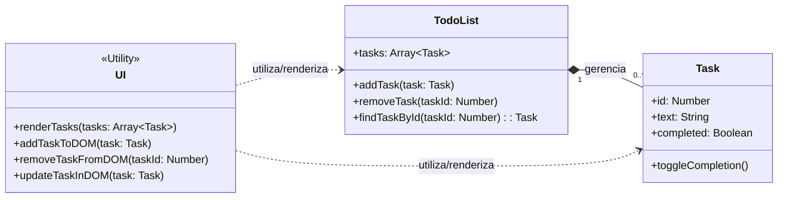

# Implementando uma To-do list (Gerenciador de Tarefas)

**Por que a Lista de Tarefas é um Exercício Tão Popular?**

A popularidade não é por acaso. O projeto atinge um ponto de equilíbrio perfeito entre simplicidade e potencial de complexidade, tornando-o ideal para aprender e aplicar uma vasta gama de conceitos.

1. **Relatabilidade e Simplicidade Conceitual:** Todo mundo entende o que é uma lista de tarefas. Não é preciso explicar regras de negócio complexas ou conceitos abstratos. O objetivo é claro desde o início: adicionar, visualizar, marcar como concluído e remover itens de uma lista.
2. **Escopo Definido**, mas Flexível:
   * Versão Mínima Viável (MVP): Em sua forma mais simples, pode ser feita em poucas horas, exigindo apenas um campo de texto, um botão e uma lista.
   * Potencial de Expansão: É incrivelmente fácil adicionar novas funcionalidades (edição, prazos, prioridades, filtros, etc.), permitindo que o projeto cresça junto com o conhecimento do desenvolvedor.
3. **Cobre os Fundamentos Essenciais (CRUD)**: A lista de tarefas é, essencialmente, a primeira experiência de muitos desenvolvedores com operações CRUD, que são a base da maioria das aplicações no mundo real:
   * Create (Criar): Adicionar uma nova tarefa à lista.
   * Read (Ler): Exibir todas as tarefas na tela.
   * Update (Atualizar): Marcar uma tarefa como concluída ou editar seu texto.
   * Delete (Deletar): Remover uma tarefa da lista.
4. **Feedback Visual Imediato**: Para quem está aprendendo, ver o resultado do seu código instantaneamente na tela é extremamente motivador. Adicionar uma tarefa e vê-la aparecer na lista, ou clicar em um botão e vê-la desaparecer, cria um ciclo de aprendizado rápido e gratificante.

***

<mark style="background-color:$success;">Enquanto o exercício da "Lista de Tarefas" pode ser resolvido de forma puramente procedural, a nossa implementação teve como foco principal utilizá-lo como uma ferramenta prática para ensinar e solidificar os conceitos da Programação Orientada a Objetos (POO).</mark>

***

A modelagem OO consiste em identificar os "substantivos" ou "conceitos" do nosso problema e transformá-los em classes. Para uma lista de tarefas, os conceitos principais são:

1. A Tarefa em si.
2. A **Lista de Tarefas**, que gerencia o conjunto de tarefas.
3. A **Interface de Usuário**, responsável por desenhar tudo na tela.

