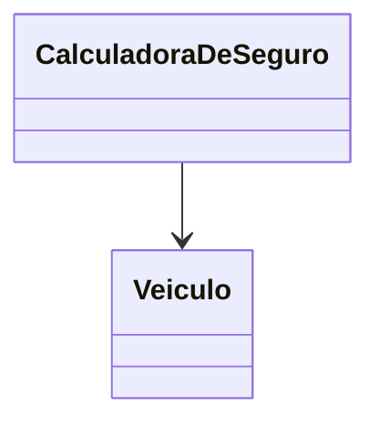

# Interação de Classes

No contexto da nossa seguradora, um dos serviços mais importantes é calcular o valor do **prêmio** do seguro.&#x20;

Esta tarefa não é um comportamento do veículo em si, mas sim um serviço fornecido por uma parte diferente do sistema.

Para realizar esse cálculo, a classe responsável precisa de acesso aos dados específicos do veículo, como o `anoDeFabricacao` e o `modelo`.

Vamos introduzir a classe `CalculadoraDeSeguro` para demonstrar essa interação e o **acoplamento** resultante.


**Acoplamento** refere-se ao grau de interdependência que existe entre dois ou mais módulos (ou classes) em um sistema. Ele mede a força com que uma classe está conectada ou depende da definição de outra classe.


**Exemplo de Interação de Classes**

Para realizar o cálculo do valor do prêmio do seguro, a classe responsável (\``` CalculadoraDeSeguro` ``) precisa de acesso aos dados específicos do veículo, como o `anoDeFabricacao` e o `modelo`.

Vamos introduzir a classe `CalculadoraDeSeguro` para demonstrar essa interação.

Classe 1: `Veiculo` (Já conhecida) Esta classe armazena os dados, utilizando atributos como `modelo`, `cor`, `anoDeFabricacao` e `placa`. O construtor é usado para garantir que o objeto seja inicializado em um estado válido.

```javascript
class Veiculo {
   modelo;
   cor;
   anoDeFabricacao;
   // ...

   constructor(modelo, cor, ano, placa) {
      this.modelo = modelo;
      this.cor = cor;
      this.anoDeFabricacao = ano;
      this.placa = placa;
   }
   
   // ... (Método gerarRelatorio, etc.)
}
```

Classe 2: `CalculadoraDeSeguro` (Nova) Esta classe terá um método (`calcularPremio`) que aceita um objeto `Veiculo` como parâmetro e usa as informações dele para realizar o cálculo.

```
class CalculadoraDeSeguro {
   
   // Este método recebe uma instância da classe Veiculo
   calcularPremio(veiculo) {
      let valorBase = 1000;
      
      // O cálculo é mais barato para veículos mais antigos
      if (veiculo.anoDeFabricacao < 2000) {
         valorBase -= 500;
      }
      
      let resultado = `O prêmio do seguro para o ${veiculo.modelo} é R$ ${valorBase}.`;
      return resultado;
   }
}
```

Para atingir o propósito de calcular o seguro, as classes interagem no código principal:

```javascript
// 1. Instanciamos o objeto Veículo
let fusca = new Veiculo("Fusca", "azul", 1988, "XAU2000"); 

// 2. Instanciamos o objeto Calculadora
let calc = new CalculadoraDeSeguro();

// 3. A Calculadora atua sobre o objeto Veiculo
let premio = calc.calcularPremio(fusca); 

console.log(premio); 
// Resultado: O prêmio do seguro para o Fusca é R$ 500.
```

Neste exemplo, a classe `CalculadoraDeSeguro` está **acoplada** à classe `Veiculo`.&#x20;

Ela precisa saber que `Veiculo` possui um atributo chamado `anoDeFabricacao` para poder executar seu método `calcularPremio`.

Se alterarmos o nome do atributo `anoDeFabricacao` na classe `Veiculo`, a classe `CalculadoraDeSeguro` também precisará ser modificada, pois ela depende da estrutura interna de `Veiculo`.&#x20;



Isso ilustra como a interação entre classes cria um grau de acoplamento entre elas. O objetivo é gerenciar essa dependência para mantê-la a mais fraca possível.


Analogia: O acoplamento pode ser comparado a dois vagões de trem. Se eles estiverem ligados por um único e robusto gancho (alto acoplamento), se um vagão descarrilar, o outro será puxado junto e ambos quebrarão. Se eles estiverem levemente ligados e puderem se mover de forma relativamente independente (baixo acoplamento), o descarrilamento de um causará menos dano ao outro. O baixo acoplamento nos permite trocar ou consertar um vagão sem ter que parar o sistema inteiro.

