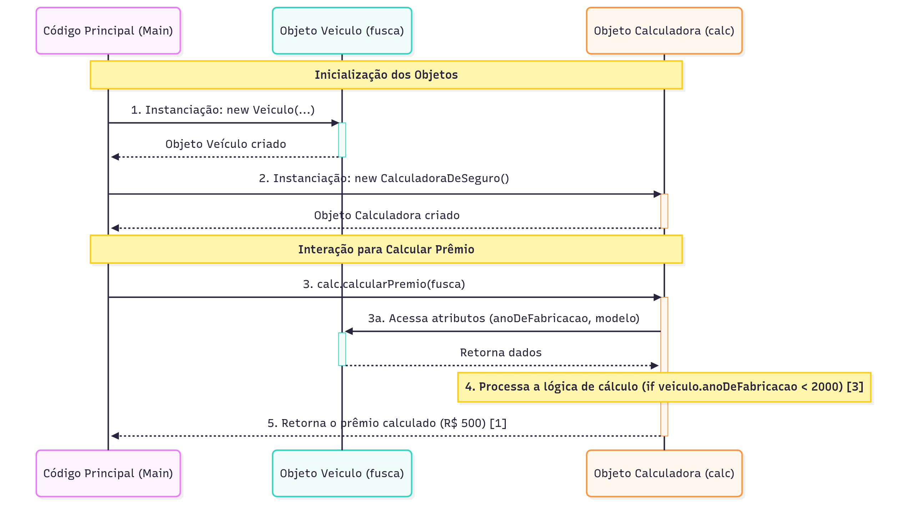
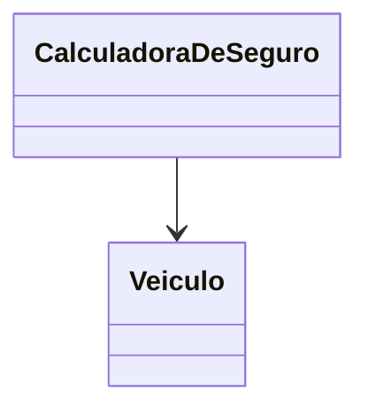
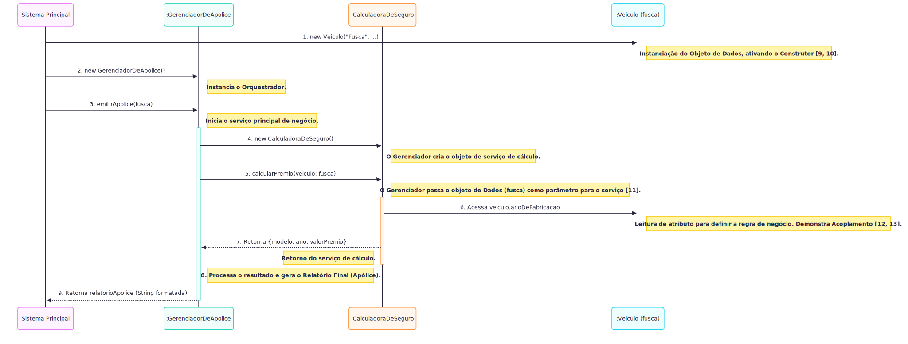
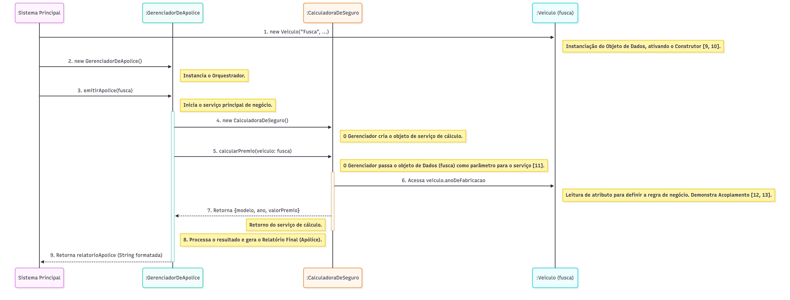

# Interação de Classes

No contexto da nossa seguradora, um dos serviços mais importantes é calcular o valor do **prêmio** do seguro.&#x20;

Esta tarefa não é um comportamento do veículo em si, mas sim um serviço fornecido por uma parte diferente do sistema.

Para realizar esse cálculo, a classe responsável precisa de acesso aos dados específicos do veículo, como o `anoDeFabricacao` e o `modelo`.

Vamos introduzir a classe `CalculadoraDeSeguro` para demonstrar essa interação e o **acoplamento** resultante.


**Acoplamento** refere-se ao grau de interdependência que existe entre dois ou mais módulos (ou classes) em um sistema. Ele mede a força com que uma classe está conectada ou depende da definição de outra classe.


**Exemplo de Interação de Classes**

Para realizar o cálculo do valor do prêmio do seguro, a classe responsável (\``` CalculadoraDeSeguro` ``) precisa de acesso aos dados específicos do veículo, como o `anoDeFabricacao` e o `modelo`.

Vamos introduzir a classe `CalculadoraDeSeguro` para demonstrar essa interação.

Classe 1: `Veiculo` (Já conhecida) Esta classe armazena os dados, utilizando atributos como `modelo`, `cor`, `anoDeFabricacao` e `placa`. O construtor é usado para garantir que o objeto seja inicializado em um estado válido.

```javascript
class Veiculo {
   modelo;
   cor;
   anoDeFabricacao;
   // ...

   constructor(modelo, cor, ano, placa) {
      this.modelo = modelo;
      this.cor = cor;
      this.anoDeFabricacao = ano;
      this.placa = placa;
   }
   
   // ... (Método gerarRelatorio, etc.)
}
```

Classe 2: `CalculadoraDeSeguro` (Nova) Esta classe terá um método (`calcularPremio`) que aceita um objeto `Veiculo` como parâmetro e usa as informações dele para realizar o cálculo.


```javascript
class CalculadoraDeSeguro {
   
   // Este método recebe uma instância da classe Veiculo
   calcularPremio(veiculo) {
      let valorBase = 1000;
      
      // O cálculo é mais barato para veículos mais antigos
      if (veiculo.anoDeFabricacao < 2000) {
         valorBase -= 500;
      }
      
      let resultado = `O prêmio do seguro para o ${veiculo.modelo} é R$ ${valorBase}.`;
      return resultado;
   }
}
```


Para atingir o propósito de calcular o seguro, as classes interagem no código principal:

```javascript
// 1. Instanciamos o objeto Veículo
let fusca = new Veiculo("Fusca", "azul", 1988, "XAU2000"); 

// 2. Instanciamos o objeto Calculadora
let calc = new CalculadoraDeSeguro();

// 3. A Calculadora atua sobre o objeto Veiculo
let premio = calc.calcularPremio(fusca); 

console.log(premio); 
// Resultado: O prêmio do seguro para o Fusca é R$ 500.
```

<figure><figcaption></figcaption></figure>

**Acoplamento**

Neste exemplo, a classe `CalculadoraDeSeguro` está **acoplada** à classe `Veiculo`.&#x20;

Ela precisa saber que `Veiculo` possui um atributo chamado `anoDeFabricacao` para poder executar seu método `calcularPremio`.

Se alterarmos o nome do atributo `anoDeFabricacao` na classe `Veiculo`, a classe `CalculadoraDeSeguro` também precisará ser modificada, pois ela depende da estrutura interna de `Veiculo`.&#x20;



Isso ilustra como a interação entre classes cria um grau de acoplamento entre elas. O objetivo é gerenciar essa dependência para mantê-la a mais fraca possível.


Analogia: O acoplamento pode ser comparado a dois vagões de trem. Se eles estiverem ligados por um único e robusto gancho (alto acoplamento), se um vagão descarrilar, o outro será puxado junto e ambos quebrarão. Se eles estiverem levemente ligados e puderem se mover de forma relativamente independente (baixo acoplamento), o descarrilamento de um causará menos dano ao outro. O baixo acoplamento nos permite trocar ou consertar um vagão sem ter que parar o sistema inteiro.


### Interação de Três Classes: Orquestrando o Processo de Negócio

Após compreendermos a interação básica e o acoplamento entre duas classes, vamos expandir nosso cenário para um exemplo prático que simula o fluxo completo de um **processo de negócio** em nossa seguradora.&#x20;


**Processo de Negócio (ou&#x20;**_**Business Process**_**)** é uma coleção de atividades estruturadas e inter-relacionadas, executadas por pessoas, sistemas ou ambos, que, ao serem completadas, produzem um produto ou serviço específico de valor para um cliente (interno ou externo) ou para atingir um objetivo organizacional.


No desenvolvimento de software, os termos **Processos de Negócio** e **Regras de Negócio** fazem parte do vocabulário técnico.


Do ponto de vista prático do desenvolvimento, uma **Regra de Negócio** é:

Uma função, método, classe ou conjunto de instruções de código que encapsula uma política ou restrição organizacional, garantindo que o sistema atenda aos requisitos do negócio e mantenha a consistência dos dados e do fluxo de trabalho.


Em um sistema real de Programação Orientada a Objetos (POO), é comum que uma classe atue como **orquestradora**, centralizando a lógica e definindo a sequência de ações que devem ser executadas utilizando os serviços e dados de outras classes .

Para simular o processo de Emissão de uma Apólice de Seguro, utilizaremos o seguinte conjunto de classes:

1. **Veiculo (A Entidade de Dados)**: O objeto que armazena as características (dados).
2. **CalculadoraDeSeguro (A Entidade de Serviço)**: O objeto que fornece um serviço específico (o cálculo do prêmio).
3. **GerenciadorDeApolice (A Entidade Orquestradora)**: A nova classe orquestradora que une os dados ao serviço para entregar o resultado final.


```javascript
class GerenciadorDeApolice {

    // Método que centraliza a lógica de negócio completa
    emitirApolice(veiculo) {
        // 1. Instancia o objeto de serviço necessário
        let calculadora = new CalculadoraDeSeguro(); 

        // 2. O Gerenciador utiliza o serviço, passando o objeto Veiculo como argumento
        let resultadoCalculo = calculadora.calcularPremio(veiculo); 

        // 3. Processa e retorna o resultado final
        let numeroApolice = Math.floor(Math.random() * 10000); // Simulação de um novo dado
        
        let relatorioApolice = `
        -------------------------------------------
        APÓLICE Nº ${numeroApolice} EMITIDA
        Modelo: ${veiculo.modelo} (${veiculo.anoDeFabricacao})
        Valor do Prêmio: R$ ${resultadoCalculo},00
        -------------------------------------------
        `;
        // O método transforma o conjunto de dados em um serviço útil para o negócio [19, 20]
        return relatorioApolice;
    }
}
```


**O Fluxo de Execução com Três Classes**

baixo, demonstramos como o código principal do sistema utiliza a classe orquestradora para realizar uma tarefa complexa de forma encapsulada:

```javascript
// 1. Instanciamos um Veículo (objeto de dados), usando o construtor [12, 21]
let fusca = new Veiculo("Fusca", "azul", 1988, "XAU2000"); 

// 2. Instanciamos o Gerenciador (o orquestrador)
let gerenciador = new GerenciadorDeApolice();

// 3. Chamamos o método orquestrador, passando o Veículo
let apolice = gerenciador.emitirApolice(fusca);

console.log(apolice);
// Resultado (Exemplo, supondo que 1988 é < 2000, logo o valor é reduzido em 500) [16]:
/*
-------------------------------------------
APÓLICE Nº [Número Aleatório] EMITIDA
Modelo: Fusca (1988)
Valor do Prêmio: R$ 500,00
-------------------------------------------
*/
```

<figure><figcaption></figcaption></figure>

<figure><figcaption></figcaption></figure>

<figure><figcaption></figcaption></figure>
