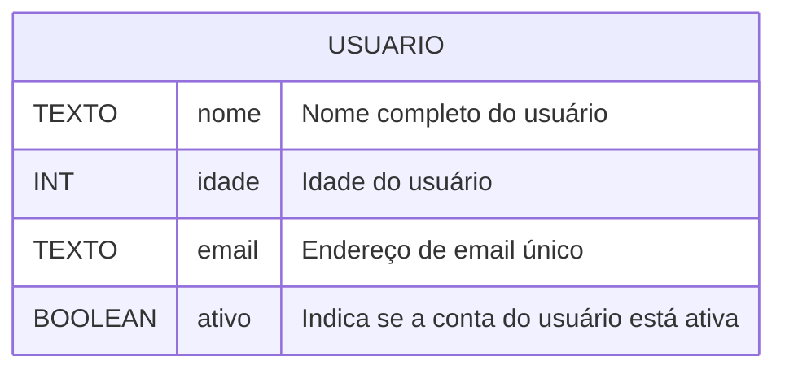

# Notação de Objeto Literal

Por exemplos, imagine que estamos desenvolvendo um software que apresenta como uma de suas funcionalidades a **gestão de usuários. Os usuários devem apresentar, necessariamente, as seguintes informações:**



### Uma abordagem de representação utilizando variáveis escalares

```javascript
// Definindo variáveis escalares para representar um usuário

// Nome do usuário (String)
let nomeUsuario = "Alice";

// Idade do usuário (Número)
let idadeUsuario = 25;

// Email do usuário (String)
let emailUsuario = "alice@exemplo.com";

// Status de atividade da conta do usuário (Booleano)
let usuarioAtivo = true;

```

Embora as variáveis escalares sejam fundamentais e úteis para dados individuais, elas apresentam várias desvantagens quando usadas para representar um conceito complexo como um "usuário".

***

#### Desvantagens da Representação de Usuário com Variáveis Escalares

1. **Dificuldade de Agrupamento e Coesão:**
   * **Perda de Semântica**: As variáveis `nomeUsuario`, `idadeUsuario`, `emailUsuario`, `usuarioAtivo` estão soltas. Embora saibamos que se referem ao mesmo "usuário", o JavaScript não tem um mecanismo intrínseco que as agrupe logicamente. A relação entre elas é apenas por convenção no nome, o que é frágil.
   * **Espalhamento de Dados**: Se você tiver 100 usuários, precisaria de 400 variáveis separadas (100 `nomeUsuario1`, 100 `idadeUsuario1`, etc.), o que é inviável e gera um código extremamente desorganizado.
2. **Dificuldade na Manipulação e Passagem de Dados:**
   * **Passagem de Argumentos em Funções**: Se você precisar passar as informações de um usuário para uma função, teria que passar cada variável escalar como um argumento individual: `function exibirUsuario(nome, idade, email, ativo) { ... }`. Com muitos atributos, a lista de argumentos se torna longa e difícil de gerenciar.
   * **Retorno de Funções**: De forma similar, se uma função precisasse "retornar" um usuário, ela teria que retornar múltiplas variáveis ou um array, o que não é tão elegante ou claro quanto retornar um objeto único.
3. **Maior Risco de Erros e Inconsistências:**
   * Atribuição Incorreta: É muito fácil atribuir o `email` de um usuário à variável de `nome` de outro usuário acidentalmente, pois não há um contêiner que garanta que esses dados permaneçam juntos para uma mesma "entidade".
   * Falta de Tipagem Forte (em outras linguagens): Embora JavaScript seja fracamente tipado, em linguagens com tipagem forte, a falta de uma estrutura de objeto significaria a perda de verificações de tipo que poderiam prevenir erros.
4. **Reutilização de Código Limitada:**
   * **Replicação de Lógica**: Se você precisar de funções para "validar nome", "calcular idade", etc., e essas funções forem aplicadas a diferentes "usuários", você teria que repetir a lógica ou criar funções genéricas que aceitem múltiplos argumentos, o que novamente dificulta a manutenção.
   * **Falta de Encapsulamento**: Não há como associar comportamentos (métodos) diretamente a um conjunto específico de dados. As funções que operam sobre o usuário ficariam "soltas" no código, sem uma relação explícita com os dados que manipulam.
5. **Manutenção e Escalabilidade Complexas:**
   * **Adicionar Novos Atributos**: Se você precisar adicionar um novo atributo (por exemplo, `endereco` ou `dataCadastro`), teria que criar uma nova variável escalar para cada usuário e modificar todas as funções que trabalham com usuários para incluir essa nova variável.
   * **Dificuldade em Modelar Relações**: Se o usuário tiver um "endereço" que por sua vez tem "rua", "cidade", "CEP", representar isso com variáveis escalares se tornaria uma bagunça gigantesca (e.g., `usuario1Rua`, `usuario1Cidade`, `usuario1CEP`).
6. **Código Menos Legível e Intuitivo**:
   * O código que lida com dados de um usuário se torna menos natural de ler e entender, pois a relação lógica entre as variáveis não é imposta pela estrutura da linguagem.

<mark style="background-color:$success;">Em suma, enquanto variáveis escalares são ótimas para dados atômicos, elas falham miseravelmente em fornecer a estrutura, a coesão e a organização necessárias para representar entidades complexas com múltiplos atributos e comportamentos, que é exatamente o problema que os objetos (e, por extensão, a Programação Orientada a Objetos) se propõem a resolver.</mark>

### Primeiras ferramentas de Orientação a Objetos em Javascript

### A Anatomia de um Objeto Literal

A sintaxe é simples e poderosa. Usamos chaves `{}` para definir o objeto.

```javascript
const usuario = {
  // Chave : Valor
  nome: "Alice",
  idade: 25,
  email: "alice@exemplo.com",
  ativo: true
};
```

* `{ }`: As chaves definem o início e o fim do objeto.
* `nome`: É a chave (ou _key_). Geralmente uma string sem aspas, se for um identificador válido.
* `:`: O dois-pontos separa a chave do valor.
* `"Alice"`: É o valor (_value_) associado à chave.
* `,`: A vírgula separa os pares de chave-valor.
